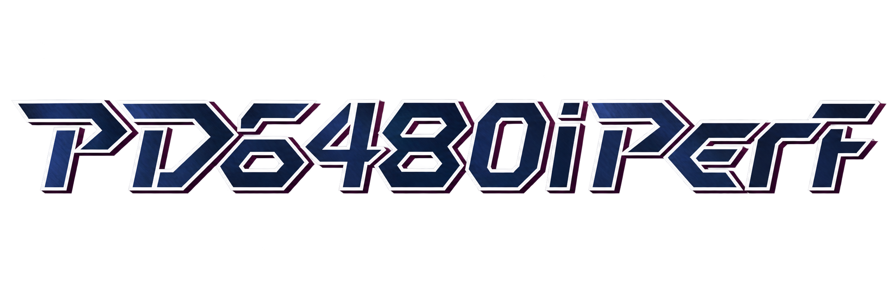

# PD6480iperf

Perfect Dark for N64: fixed **640×480 interlaced rendering** combined with the newer performance source, an **L-toggle FPS graph**, and fixes for the higher-resolution menus and camera effects.

## Current candidate: v87 (CamSpy fix)

**The user reports that CamSpy now works on Analogue 3D.** v87 fixes the broken lens and vertical blue/cyan lines seen during photography in Investigation. It retains the earlier menu-navigation and full-screen pause-blur fixes.

- [Download patch + optional 100% Dark save](artifacts/PD6480iperf-v87-camspy-patch-and-Dark-save.zip)
- [Patch only](artifacts/PD6480iperf-v87-camspy-candidate.xdelta)
- [Installation, base-ROM hash and save instructions](docs/INSTALL.md)
- [CamSpy comparison and validation evidence](evidence/v87-camspy-20260913/README.md)

Use your own clean **USA v1.1, big-endian `.z64`** ROM. An **Expansion Pak is required on original N64**. Resolution is already fixed at 640×480i; the Hi-Res menu item is intentionally non-interactive. Press **L** to show or hide the graph.

The optional stock-format **Dark** EEPROM has 100% unlocks with stock controls/settings; cheats are unlocked, not activated. Back up your existing save before importing it. No full ROM is included in the current patch bundle.

## What has actually been tested?

| Platform / check | Result and scope |
| --- | --- |
| Analogue 3D | User-confirmed v87 CamSpy fix. Earlier v86g feedback covers gameplay, L graph, menu navigation and pause blur. |
| Original N64 + Expansion Pak | Exact normal v87 ROM uploads and progresses through the animated 3D intro. **Not** an interactive CamSpy test. |
| Software, v87 | Cold-boot Investigation; CamSpy activation, shutter, settled view, movement and exit; pause/resume and visible L-toggle pair. |
| Wider regression checks | v86g: 21/21 mission initialization gates, plus short AI co-op and four-player checks. **Not** full mission completion or a fresh v87 full-mode sweep. |

This remains a **test candidate**, not a claim of exhaustive compatibility. Isotope-objective completion, original-N64 CamSpy gameplay, other EyeSpy variants and comparative FPS benchmarks remain unverified. See the [testing matrix](docs/TESTING.md).

## Read the project

| I want to… | Start here |
| --- | --- |
| Apply the patch / import Dark | [Install](docs/INSTALL.md) |
| Understand the bugs and fixes | [Technical findings](docs/FINDINGS.md) |
| Check validation limits / report a bug | [Testing](docs/TESTING.md) |
| Reproduce or modify the runtime | [Source and build guide](docs/BUILD.md) |
| Follow development history | [Milestones and archive](docs/HISTORY.md) |
| Browse all documentation | [Documentation index](docs/README.md) |

### Two branches, different jobs

| Branch | Purpose |
| --- | --- |
| `mods/performance` (this default branch) | Patch/save distribution, documentation, evidence and historical integration source. **Its `src/` does not reproduce v87.** |
| [`fix/v87-camspy-480i`](https://github.com/Cyiatic/PD6480iperf/tree/fix/v87-camspy-480i) | Buildable v87 runtime; public source pin [`82d704d01`](https://github.com/Cyiatic/PD6480iperf/commit/82d704d0154ea86f9e5d0fb98541907806f31960). |

The release payloads are unchanged. Their September 13 README/manifest are packaging-time snapshots; this front page and [dated acceptance update](evidence/v87-camspy-20260913/analogue-user-feedback.md) include the later user confirmation.

## Credits and repository scope

Based on **Ryan Dwyer's Perfect Dark decompilation, performance work and 640×480i work**. Thanks to the user and Graslu00 for test feedback and the CamSpy report.

Source licensing is in [LICENSE](LICENSE). The code license does not grant rights to distribute the original game's ROM or extracted assets. Full ROMs and bundled host/IRIX binaries have been removed from the published history; local backups remain private. Patches, saves, source and small verification artifacts are retained.

The public history uses new commit IDs, but the v87 ROM/patch/save bytes and game source are unchanged. See [public-release audit and migration notes](docs/PUBLIC_RELEASE.md) for the cleanup scope and original-to-public commit map. If you have an old private clone, start with a fresh public clone rather than merging or force-pushing its history.

## AI Assistance Disclosure

This project was developed with AI assistance from OpenAI Codex for reverse
engineering support, scripting, documentation, visual comparison workflows, and
candidate iteration. The repository owner directed the work, reviewed the
resulting changes, and remains responsible for the project's technical claims
and final decisions. Hardware setup, real-console testing, and subjective visual
evaluation were performed by the repository owner.

The README logo was also generated with AI from the supplied Perfect Dark
lettering reference; see [logo provenance and prompt](images/README.md).
For this project's automated original-N64 checks, Codex operated the ED64,
Kasa and Elgato workflow under the owner's direction; the platform-specific
results remain distinguished in the [testing ledger](docs/TESTING.md).

