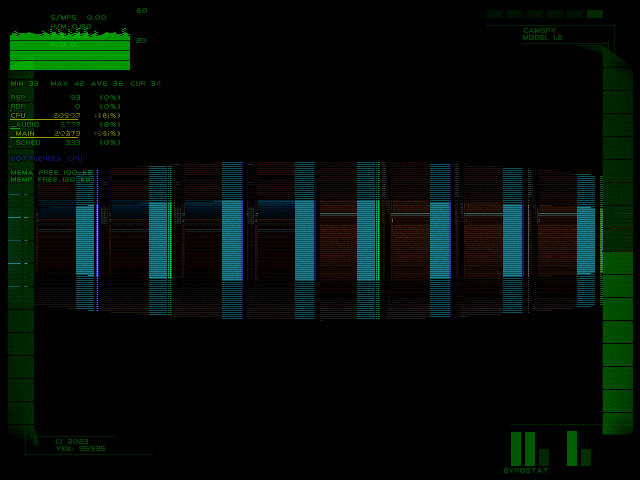
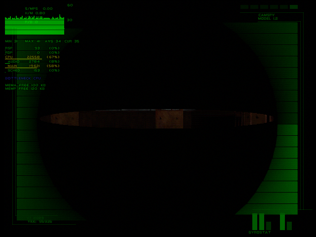

# Technical findings

[Project home](../README.md) · [Testing](TESTING.md) · [Runtime source](BUILD.md)

This is the current synthesis as of September 17, 2026. Historical experiments are linked as evidence, not presented as current candidates. Findings below distinguish observed failures, source-level explanations and remaining uncertainty.

## 1. This is source integration, not two stacked patches

The supplied `pd-perf.xdelta` matches the newer performance control except for ten header/CRC bytes. The other `performance.xdelta` produces a substantially different image and was treated as an alternate/older line; filenames alone do not prove chronology. Both expect the clean USA v1.1 base.

Early integration used an older performance source. The modern v81-and-later line instead starts directly from `bf3245076d00fbbb29ca1e0906672381f2d43a52`, incorporating the 75 intervening upstream commits identified by the earlier lineage audit. v87 is not the old base plus a few selected backports.

The buffers and room-residency policy are deliberately adapted. Inclusion of the newer source is **not** byte-identical performance-patch behavior, full room-preload parity or proof of measured speed gains.

Evidence: [input patch analysis](input-patch-analysis.md), [historical lineage audit](performance-lineage-gap-audit.md), [modern v82b integration record](PD6480iperf-v82b.md).

## 2. 480i output alone does not prove 640×480 rendering

The current runtime defines 640×480 logical geometry, two full-size RGBA16 colour buffers, full-size depth storage and alternating-field VI configuration. This is not merely a low-resolution framebuffer fed into a 480i output mode.

| Allocation | Bytes | Placement / role |
| --- | ---: | --- |
| Colour buffer 0 | 614,400 | `0x8036A000`, at the top of the first 4 MiB bank |
| Colour buffer 1 | 614,400 | `0x8076A000`, at the top of the second 4 MiB bank |
| Depth storage including alignment allowance | 614,464 | Full-resolution depth allocation |
| Combined allocation | 1,843,264 | About 1.76 MiB, before other game memory |

Source definitions plus matching-build runtime inspection establish the configured dimensions. Elgato's 640×480 capture metadata, or Analogue's output scaler, is not an independent measurement of internal rendering.

The full **8 MiB** is already in use. There is no unused Expansion Pak switch to enable. Two colour buffers are necessary to make this configuration fit alongside the game; upstream triple buffering plus unrestricted preload exceeded the budget.

Evidence: [pinned framebuffer constants](https://github.com/Cyiatic/PD6480iperf/blob/802059812519fef5d08c8f8e4ba86ff033c296ac/src/include/video480i.h), [v82b buffer integration](PD6480iperf-v82b.md), [v87 runtime inspection](../evidence/v87-camspy-20260913/v87-camspy-qa-report.md).

## 3. Buffer ownership matters as much as allocation

A framebuffer must not be reused while VI scanout or an outstanding graphics task still owns it. Address comparisons use physical aliases and cover current/next VI plus scheduled/queued images. The static copyright texture is a distinct boot case.

This explains why adding larger buffers is not sufficient: the scheduler, VI slots, title transitions and memory layout must agree. Early black screens and crash photos were not all proven to have one common cause. In particular, v82's reproduced briefing failure came from making shared menu scratch lazy without allocating it before briefing callbacks; v82b corrected that regression.

Evidence: [pinned ownership helper](https://github.com/Cyiatic/PD6480iperf/blob/802059812519fef5d08c8f8e4ba86ff033c296ac/src/include/pd480_framebuffer.h), [v82b briefing diagnosis](PD6480iperf-v82b.md).

## 4. Menus and pause blur contained 320×240 assumptions

The pause image remains a small 40×30 texture. Previously its 8×8 sampling blocks covered only the upper-left 320×240 area, and overlay geometry also ended at 320×240. The fix scales sampling to the actual framebuffer, reads RDP-produced data through the uncached alias, and expands the overlay quads to the full screen. The perspective menu effect is retained.

The blur's producer and consumer need 2,400 bytes, not the old 19,200-byte reservation. Correcting that allocation recovered **16,800 bytes** without lowering the output resolution.

The old Hi-Res checkbox is now a non-interactive fixed-resolution label. This avoids a misleading second mode switch while retaining the stock save bit and save compatibility. User feedback confirms the corrected pause blur and menu navigation.

Evidence: [v84 menu/blur evidence](../evidence/v84-fullscreen-menu-blur/README.md), [v85 allocation and broader test results](../evidence/v85-full-mission-matrix/README.md), [earlier Analogue acceptance](../evidence/v86g-completion-reserve/analogue-user-feedback.md).

## 5. Full-resolution buffers require a bounded room cache

CI and a few small stages were insufficient acceptance tests: the v85 broader matrix exposed failures on 11 of 21 stage-initialization attempts.

The v86 line budgets room geometry from remaining memory after reserving general work space and menu scratch. It warms required texture/dynamic-texture/hit data, preloads geometry opportunistically and evicts eligible least-recently-used room geometry with its hit batches. Submitted graphics-frame epochs protect rooms still in use by RSP/RDP; simulation ticks are not a safe lifetime substitute.

Follow-ups account for pending controller menu contexts, co-op buddy models and retained model allocations. Quiescent reuse requires an atomic graphics-idle check before recycling older geometry. This is a memory/ownership adaptation, not a promise to keep every room resident.

Evidence: [v85 failures](../evidence/v85-full-mission-matrix/README.md), [v86f quiescent reuse](../evidence/v86f-quiescent-room-reuse/README.md), [v86g validation summary](../evidence/v86g-completion-reserve/README.md).

## 6. Advisory retraces must leave room for completion messages

An observed v86f software stall had a full 32-slot main queue blocking graphics completion delivery. Retraces then filled the interrupt queue and the SP completion notification was dropped.

v86g reserves two main-queue slots by throttling advisory retrace notifications. Completion messages retain their existing lossless, blocking delivery. Actual-C and modeled interleaving tests exercise saturation; zero/one-slot negative controls fail.

Causal limit: a same-layout zero-reserve control also passed the cold Extraction check. That one successful boot therefore does **not** isolate the fix. The original blocked queue trace and saturation tests provide the stronger evidence.

Evidence: [queue investigation and controls](../evidence/v86g-completion-reserve/README.md), [zero-reserve control](../evidence/v86g-completion-reserve/noreserve-control/README.md).

## 7. CamSpy mixed physical row counts with old lens limits

The reported defect was visible in Investigation: a black central lens and vertical cyan/blue bands during the shutter.

| v86g: reproduced defect | v87: corrected shutter |
| --- | --- |
|  |  |

These are the matched software comparison captures, not photographs of Analogue or original N64 output.

At 480 rows the folded radius reaches 240, but the old helper returned 0.01 at values of 128 or above. That incorrectly closed the middle 225 rows. The reciprocal texture step became 102,400, overflowing its signed 16-bit 5.10 field. A two-half-row copy also introduced discontinuity at non-unit scales, and HUD bars applied horizontal scaling twice.

v87 changes only `src/game/bondview.c` at runtime relative to v86g:

- Normalize the lens radius to framebuffer height and remove the 128-row cutoff.
- Load a complete 640×1 RGBA16 row (1,280 bytes of TMEM) before writing the aperture back.
- Bound texture origins and signed steps; use a centre texel for tiny apertures.
- Clip masks to the viewport, guard a closed-shutter division and scale HUD endpoints consistently.
- Leave the original scanline copier used by other effects untouched.

The actual-C harness passes **193,800** row/startup/damage cases across six viewport layouts; the old radius fails its negative control. This checks math and generated graphics arguments, not physical RDP behavior by itself. A cold-boot software comparison shows the original bands and their absence in v87. The user subsequently reports **“camspy works good” on Analogue 3D**.

Evidence: [v87 comparison](../evidence/v87-camspy-20260913/README.md), [source diff](https://github.com/Cyiatic/PD6480iperf/commit/802059812519fef5d08c8f8e4ba86ff033c296ac), [user confirmation](../evidence/v87-camspy-20260913/analogue-user-feedback.md).

## 8. Hiding the graph is not the same as restoring stock controls

The original graph modification reserved L for its toggle and zeroed stock
L/D-pad masks across gameplay and menus. That prevents mirrored-grip 1.2 play:
D-pad movement with the left hand, analogue-stick look with the right, and L aim.
The issue is not solved by toggling the graph invisible.

v88 is a separate no-graph alternative to v87. It reverses all **84 surviving
input-mask edits** across eight files and removes graph sampling, drawing and
hotkey handling in `lv.c`. Two already-removed legacy paths are not reintroduced.
The `bondview.c` changes here concern input masks, not the CamSpy geometry fix.
Framebuffer, scheduling and room-cache code remain unchanged.

Source checks and focused software 1.2 movement/aim tests pass. Original-N64
intro boot is verified; Analogue 3D and physical-controller gameplay are still
pending for this variant. The Dark save is unchanged and does not force 1.2.

Evidence: [v88 findings and provenance](V88_NO_GRAPH.md),
[test reports](../evidence/v88-no-graph/README.md),
[runtime changes](https://github.com/Cyiatic/PD6480iperf/commit/cb4e30de6433bbd4cc47e4f0b739700db15efb96).

## What these findings do not establish

- Completion of the radioactive-isotope objective.
- Every EyeSpy variant, multiplayer layout, stage or menu on either edition.
- Analogue compatibility or a complete live-input matrix for v88.
- Interactive CamSpy gameplay on original N64.
- A quantitative FPS improvement over retail or the standalone patches.
- One universal cause for every historical crash.

The [testing matrix](TESTING.md) is the acceptance ledger. Do not promote a source audit, emulator snapshot or animated intro into a broader hardware/gameplay claim.
