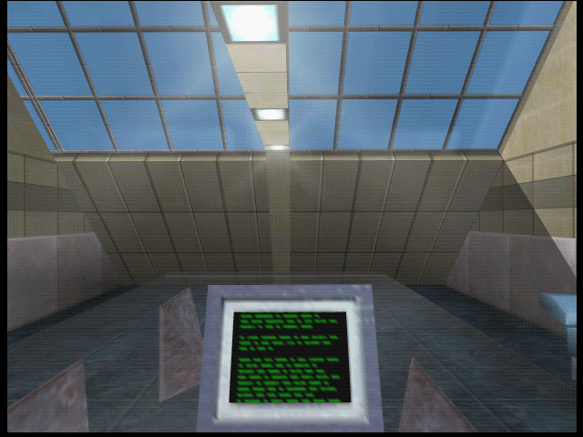
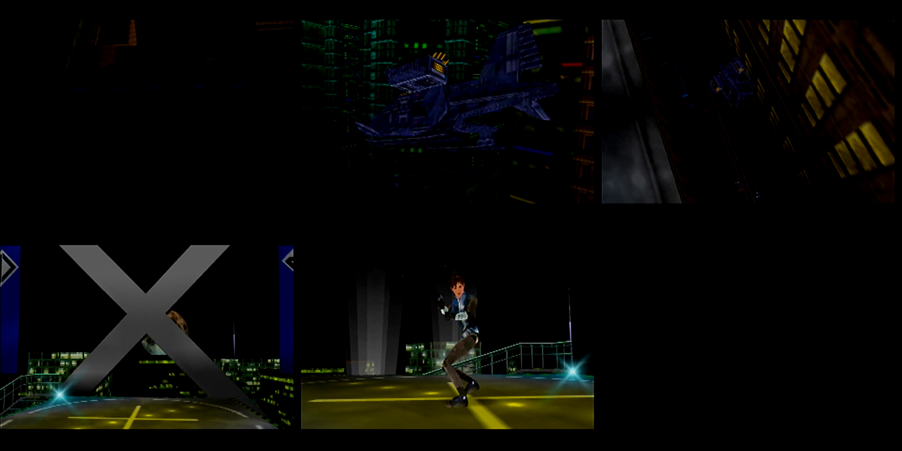

# v88 no-graph / stock-controls evidence

[Candidate notes](../../docs/V88_NO_GRAPH.md) · [GitHub prerelease](https://github.com/Cyiatic/PD6480iperf/releases/tag/v88-no-graph)

Checks performed September 16–17, 2026. Exact retail-header candidate SHA-256:
`7971eb42e66ba1d5773e7a5c557f4ea578e7800e862f350b2ce5908b21223891`.

| Evidence | What it establishes | Limit |
| --- | --- | --- |
| [Source controls](source-controls.json) | All 84 surviving stock input-mask edits restored; old input/graph negative controls rejected. | Not physical input testing. |
| [Software controls](software-controls.json) | Cold Carrington Institute, 640×480; scheme 1.2 D-pad movement, stick look, L hold/toggle aim, R aim, graph absent. | Only settings were instrumented in RAM; a core-only EEPROM-header adapter loaded Dark. Neither alters the distributed ROM. |
| [CamSpy regression](camspy-source.json) | 193,800 actual-C math/GBI-argument cases pass; broken-aperture negative control rejected. | Not a new hardware CamSpy test. |
| [Asset audit](asset-audit.json) | 1,403 valid compressed assets, zero invalid streams. | 608 raw assets unchecked. |
| [Original N64](hardware.json) | Exact candidate uploaded over ED64; Elgato recording shows progressing animated intro beyond startup. | Boot/intro only, not physical-controller gameplay. Capture dimensions alone do not establish render resolution. |

## Software gameplay sample

## Original-N64 intro contact sheet

The bounded recording was inspected and deleted; these compact stills remain.
Plug 1 OFF was confirmed afterward. The unrelated “N64” outlet was not touched.

**Analogue 3D, physical-controller gameplay, long sessions and multiplayer have
not been retested for v88.** v87's Analogue feedback applies to v87, not this
new input variant. Menu/CamSpy/hoverbike input restoration has source proof,
not a complete live-input matrix. See the [candidate notes](../../docs/V88_NO_GRAPH.md)
for the baseline compressed-asset differences and build limitations.
